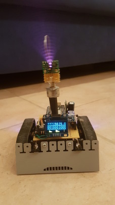

# ESP32ZUMO
Small robot based on ESP32 + ROS + ZUMO 32u4 base

Components:
* ZUMO32U4 Base (I2C Slave, Bat ADC, Motor Encoder, PWM for Lidar Stepper, l3gd20h, lsm303d, Line Sonsor, ...)
* ESP32 with PSRAM
* STM vl53l1x TOF sensor
* Rotating Lidar with PCF8475+ULN2003 Stepper motor
* BNO055 Orientation Sensor
* SSD1306 I2C Display

Target Software:
* ROS Serial ported to ESP32

Host Software:
* ROS Bringup Files
* Mapping, Laser Scan, Navigation, ...

Goals:
* Small Autonomous Robot controlled by ROS from external PC
* Small Autonomous Robot controlled by ROS running on ESP32
